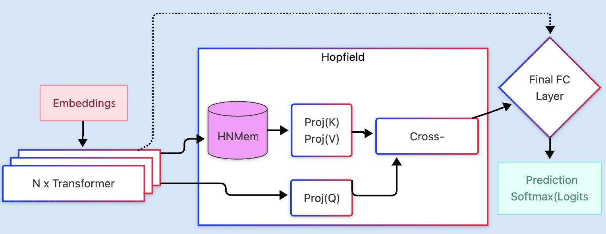

# CHopT: Continuous Hopfield Transformer: Maintaining memory across inferences

CHopT is a novel language model architecture that enhances transformer-based models (specifically Llama-3.2 3B) with a Hopfield layer, enabling continuous memory across multiple inference steps.

## Architecture



*[Hopfield layer after the transformer layers of Llama-3.2 3B]*

The CHopT architecture combines the power of modern transformer-based language models (Llama-3.2 3B) with a Hopfield network layer that serves as an associative memory system. The key innovation is placing the Hopfield layer after the transformer layers, allowing the model to:

1. Store and retrieve information across inference steps
2. Maintain context beyond the standard context window
3. Learn continuous patterns in sequential data

The Hopfield layer is implemented with a modern, differentiable design that can be trained end-to-end with the transformer model.

## Core Components

### Model Architecture (`model.py`)

This file contains the implementation of the CHopT architecture, including:

- `HopfieldLlama3Model`: The main model class combining Llama-3.2 3B with Hopfield memory
- `HopfieldMemoryLayer`: The implementation of the Hopfield memory component
- `TransformerBlock`: The standard transformer block adapted for our architecture
- Helper functions for RMSNorm, RoPE, and other transformer components
- Functions for creating and loading the model and optimizer

The Hopfield layer can be configured with various parameters:
- Memory slots
- Update strategies (gated, standard)
- Initialization methods
- Energy function parameters

### Training Pipeline (`train.py`)

This file handles the training process for the CHopT model:

- Configuration loading from YAML
- Accelerator setup for distributed training
- Data loading and preprocessing
- Model instantiation and weight loading
- Training loop with evaluation steps
- Metrics calculation and logging
- Checkpoint saving and resumption
- Integration with Weights & Biases for experiment tracking

### Inference (`inference.py`)

This file contains code for running inference with a trained CHopT model:

- Loading saved model checkpoints
- Running inference on test datasets
- Evaluating model performance
- Memory-only tests to assess memory retention
- Results logging and visualization

### Data Loading (`data_loader.py`)

This file handles data preparation, including:

- Dataset loading from Hugging Face (NarrativeQA)
- Tokenization and preprocessing
- Chunking long documents
- Batching and padding
- Custom collation for training and evaluation

### Configuration (`config.yaml`)

The configuration file defines all parameters for the model and training process:

- Model architecture parameters (embedding dim, layers, heads, etc.)
- Hopfield layer configuration
- Training hyperparameters
- Data processing settings
- LoRA fine-tuning configuration
- Evaluation settings
- Logging configuration

### Utilities and Scripts

- `train.sh`: Slurm script for launching training jobs (environment-specific)
- `inference.sh`: Slurm script for running inference (environment-specific)
- `requirements.txt`: Dependencies for the project

Both shell scripts (`train.sh` and `inference.sh`) are written for the Slurm workload manager and are specific to our computing environment. Users should modify these scripts to match their own computing environment or create their own scripts based on the Python commands provided below.

## Usage

### Installation

```bash
pip install -r requirements.txt
```

### Training

To train the model, either:

1. Modify the provided Slurm script for your environment:
```bash
# Review and modify train.sh before running
bash train.sh
```

2. Or run directly with accelerate:
```bash
accelerate launch train.py --config config.yaml
```

### Inference

To run inference with a trained model, either:

1. Modify the provided Slurm script for your environment:
```bash
# Review and modify inference.sh before running
bash inference.sh
```

2. Or run the Python script directly:
```bash
python inference.py --config config.yaml --checkpoint path/to/checkpoint
```

## Experimental Results

CHopT has demonstrated the ability to remember facts from short stories across multiple inference steps. As a proof of concept, the project shows that Hopfield networks can serve as an adaptive memory system for large language models.

The current implementation has been tested and validated on simple story comprehension tasks, demonstrating that the Hopfield memory layer enables the model to retain information between inference steps without requiring the information to be present in the context window.

## License

This project is licensed under the MIT License - see the [LICENSE](LICENSE) file for details.

```
MIT License

Copyright (c) 2024

Permission is hereby granted, free of charge, to any person obtaining a copy
of this software and associated documentation files (the "Software"), to deal
in the Software without restriction, including without limitation the rights
to use, copy, modify, merge, publish, distribute, sublicense, and/or sell
copies of the Software, and to permit persons to whom the Software is
furnished to do so, subject to the following conditions:

The above copyright notice and this permission notice shall be included in all
copies or substantial portions of the Software.

THE SOFTWARE IS PROVIDED "AS IS", WITHOUT WARRANTY OF ANY KIND, EXPRESS OR
IMPLIED, INCLUDING BUT NOT LIMITED TO THE WARRANTIES OF MERCHANTABILITY,
FITNESS FOR A PARTICULAR PURPOSE AND NONINFRINGEMENT. IN NO EVENT SHALL THE
AUTHORS OR COPYRIGHT HOLDERS BE LIABLE FOR ANY CLAIM, DAMAGES OR OTHER
LIABILITY, WHETHER IN AN ACTION OF CONTRACT, TORT OR OTHERWISE, ARISING FROM,
OUT OF OR IN CONNECTION WITH THE SOFTWARE OR THE USE OR OTHER DEALINGS IN THE
SOFTWARE.
```